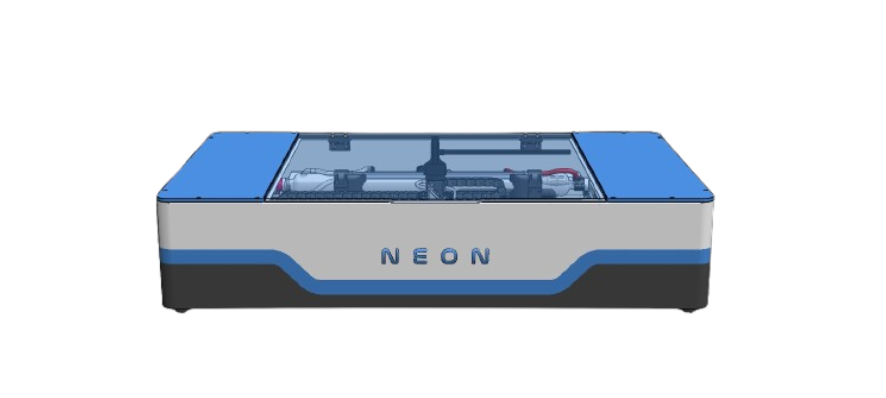

---
hide:
    - navigation
#    - toc
---
# HELLO HOW CAN WE HELP?

<figure markdown="span">

  { width="1000" }
  <figcaption></figcaption>

</figure>

## Welcome to the Neon knowledge center

-   :fontawesome-solid-book-open:{ .lg .middle } __Instruction Manual__

    ---

    In this section, you will find everything you need about the Neon manuals and how to download them.

    [:octicons-arrow-right-24: Learn More](https://edgarmata.github.io/MY-CO2Laser-CNC/manual/)

-   :fontawesome-solid-screwdriver-wrench:{ .lg .middle } __Maintenance Help__

    ---

    Need information on how to perform any type of maintenance on your Neon? This is the place.

    [:octicons-arrow-right-24: Learn More](https://edgarmata.github.io/MY-CO2Laser-CNC/maintenance/water/water-in-neon/)

-   :fontawesome-brands-app-store:{ .lg .middle } __Help with Neon Studio__

    ---

    From the first steps with Neon Studio to advanced help, here you will find various articles for your training with the software.

    [:octicons-arrow-right-24: Learn More](https://edgarmata.github.io/MY-CO2Laser-CNC/studio/install-software/)

-   :fontawesome-solid-triangle-exclamation:{ .lg .middle } __Troubleshooting__

    ---

    Having a problem with your machine? Find some simple solutions here that can help you a lot.

    [:octicons-arrow-right-24: Learn More](https://edgarmata.github.io/MY-CO2Laser-CNC/troubleshooting/different-cut/adjust-belts/)

-   :fontawesome-solid-helmet-safety:{ .lg .middle } __Safety Help__

    ---

    Safety first, learn everything about working safely with your Neon.

    [:octicons-arrow-right-24: Learn More](https://edgarmata.github.io/MY-CO2Laser-CNC/safety/safety-instructions/)

-   :fontawesome-solid-wand-magic-sparkles:{ .lg .middle } __Learn with Tips and Tricks__

    ---

    Want to learn just a little more? Then this is the place...

    [:octicons-arrow-right-24: Learn More](https://edgarmata.github.io/MY-CO2Laser-CNC/tips-tricks/best-practices/)          

## Didn't find what you were looking for?

Contact us directly, we are here to help.

<!DOCTYPE html>
<html lang="en">
<head>
    <meta charset="UTF-8">
    <meta name="viewport" content="width=device-width, initial-scale=1.0">
    <title>Document</title>
    <link rel="stylesheet" href="https://cdnjs.cloudflare.com/ajax/libs/font-awesome/6.0.0-beta3/css/all.min.css">
</head>

    <!-- WhatsApp -->
    <a href="https://api.whatsapp.com/send?1=pt_pt&phone=351924244819"
       style="width:180px; height:54px; background:#25D366; color:white;
              display:flex; align-items:center; justify-content:center;
              gap:8px; text-decoration:none; border-radius:8px; font-weight:600;">
        <i class="fab fa-whatsapp"></i>
        WhatsApp
    </a>

    <!-- Email -->
    <a href="mailto:support@my-machines.net"
       style="width:180px; height:54px; background:#444; color:white;
              display:flex; align-items:center; justify-content:center;
              gap:8px; text-decoration:none; border-radius:8px; font-weight:600;">
        <i class="fas fa-envelope"></i>
        E-mail
    </a>

    <!-- TikTok -->
    <a href="https://www.tiktok.com/@machines_net"
       style="width:180px; height:54px; background:#000; color:white;
              display:flex; align-items:center; justify-content:center;
              gap:8px; text-decoration:none; border-radius:8px; font-weight:600;">
        <i class="fab fa-tiktok"></i>
        TikTok
    </a>

    <!-- Instagram -->
    <a href="https://www.instagram.com/machines_net/"
       style="width:180px; height:54px;
              background:linear-gradient(45deg,#F58529,#DD2A7B,#8134AF,#515BD4);
              color:white; display:flex; align-items:center; justify-content:center;
              gap:8px; text-decoration:none; border-radius:8px; font-weight:600;">
        <i class="fab fa-instagram"></i>
        Instagram
    </a>

    <!-- Facebook -->
    <a href="https://www.facebook.com/machines.net/"
       style="width:180px; height:54px; background:#1877F2; color:white;
              display:flex; align-items:center; justify-content:center;
              gap:8px; text-decoration:none; border-radius:8px; font-weight:600;">
        <i class="fab fa-facebook-f"></i>
        Facebook
    </a>

    <!-- Pinterest -->
    <a href="https://pt.pinterest.com/machines_net/"
       style="width:180px; height:54px; background:#E60023; color:white;
              display:flex; align-items:center; justify-content:center;
              gap:8px; text-decoration:none; border-radius:8px; font-weight:600;">
        <i class="fab fa-pinterest-p"></i>
        Pinterest
    </a>

    <!-- YouTube -->
    <a href="https://www.youtube.com/@machines_net"
       style="width:180px; height:54px; background:#FF0000; color:white;
              display:flex; align-items:center; justify-content:center;
              gap:8px; text-decoration:none; border-radius:8px; font-weight:600;">
        <i class="fab fa-youtube"></i>
        YouTube
    </a>

        <!-- GitHub -->
    <a href="https://github.com/EdgarMata"
    style="width:180px; height:54px; background:#181717; color:white;
            display:flex; align-items:center; justify-content:center;
            gap:8px; text-decoration:none; border-radius:8px; font-weight:600;">
        <i class="fab fa-github"></i>
        GitHub
    </a>

