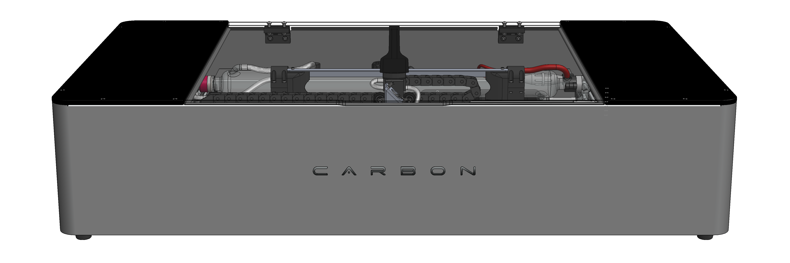

---
hide:
    - navigation
#    - toc
---
# HELLO HOW CAN WE HELP?

<figure markdown="span">

  { width="1000" }
  <figcaption></figcaption>

</figure>

## Welcome to the Carbon knowledge center

-   :fontawesome-solid-book-open:{ .lg .middle } __Instruction Manual__

    ---

    In this section, you will find everything you need about the Carbon manuals and how to download them.

    [:octicons-arrow-right-24: Learn More](https://edgarmata.github.io/Carbon-FAQS/manual/)

-   :fontawesome-solid-screwdriver-wrench:{ .lg .middle } __Maintenance Help__

    ---

    Need information on how to perform any type of maintenance on your Carbon? This is the place.

    [:octicons-arrow-right-24: Learn More](https://edgarmata.github.io/Carbon-FAQS/manuten%C3%A7%C3%A3o/%C3%A1gua/agua-na-carbon/)

-   :fontawesome-brands-app-store:{ .lg .middle } __Help with Carbon Studio__

    ---

    From the first steps with Carbon Studio to advanced help, here you will find various articles for your training with the software.

    [:octicons-arrow-right-24: Learn More](https://edgarmata.github.io/Carbon-FAQS/studio/instalar-software/)

-   :fontawesome-solid-triangle-exclamation:{ .lg .middle } __Troubleshooting__

    ---

    Having a problem with your machine? Find some simple solutions here that can help you a lot.

    [:octicons-arrow-right-24: Learn More](https://edgarmata.github.io/Carbon-FAQS/troubleshooting/corte-diferente/ajustar-correias/)

-   :fontawesome-solid-helmet-safety:{ .lg .middle } __Safety Help__

    ---

    Safety first, learn everything about working safely with your Carbon.

    [:octicons-arrow-right-24: Learn More](https://edgarmata.github.io/Carbon-FAQS/seguran%C3%A7a/instruc%C3%B5es-seguranca/)

-   :fontawesome-solid-wand-magic-sparkles:{ .lg .middle } __Learn with Tips and Tricks__

    ---

    Want to learn just a little more? Then this is the place...

    [:octicons-arrow-right-24: Learn More](https://edgarmata.github.io/Carbon-FAQS/truques-%26-dicas/vetorizar-imagem/)          

## Didn't find what you were looking for?

Contact us directly, we are here to help.

<!DOCTYPE html>
<html lang="en">
<head>
    <meta charset="UTF-8">
    <meta name="viewport" content="width=device-width, initial-scale=1.0">
    <title>Document</title>
    <link rel="stylesheet" href="https://cdnjs.cloudflare.com/ajax/libs/font-awesome/6.0.0-beta3/css/all.min.css">
</head>

    <a href="https://api.whatsapp.com/send?1=pt_pt&phone=351924244819" class="md-button" style="width: 200px; height: 54px;">
        Whatsapp <i class="fab fa-whatsapp" style="vertical-align: middle;"></i>
    </a>

    <a href="mailto:support@my-machines.net" class="md-button" style="width: 200px; height: 54px;">
        E-mail <i class="fas fa-paper-plane" style="vertical-align: middle;"></i>
    </a>

