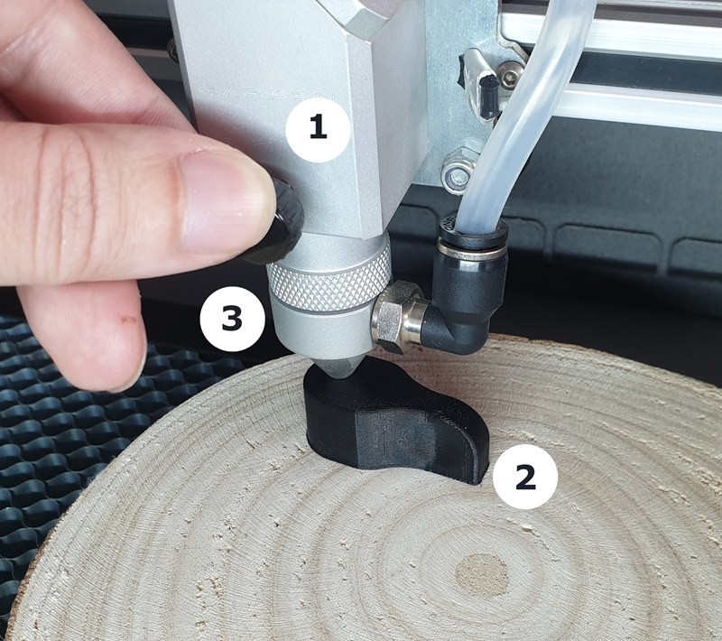

# How to adjust the laser focus

Today, we will address a crucial step to ensure the success of our cuts:

The focus adjustment.

### But why is it so important to adjust the focus?

To understand the relevance of this procedure, it is essential to comprehend that, before reaching the material, the laser passes through a lens! This lens has the function of concentrating the laser energy at a specific point (the ideal focus), ensuring a precise cut on your Carbon.

<figure markdown="span">

  { width="800" }
  <figcaption></figcaption>

  { width="800" }
  <figcaption></figcaption>

</figure>

<em>Figure 1 - Ideal focus</em>

Maintaining the same distance between the laser focus and the surface of the material is fundamental. To ensure this precision, we use our focus gauge!

## Adjusting the focus

The focus adjustment process is simple:

<figure markdown="span">

  { width="600" }
  <figcaption>Figure 2 - Adjust Focus</figcaption>

</figure>

1. Loosen the laser nozzle
2. Adjust the height of the nozzle in relation to the surface of the material using the focus gauge
3. Tighten the nozzle again in the new position.

!!! tip "Tips"
    
    * Avoid pressing the material during the focus adjustment
    * Check if the material is level

## When should I adjust the focus?

It is crucial to adjust the focus whenever you change the type of material. It is also important to check if it is adjusted if the cut does not achieve the desired quality (see figure 2).

It is common to forget to adjust the focus, even for the most experienced. Stay alert!

## How to know when my focus is not adjusted?

The best way to notice when the focus is not adjusted is to observe the thickness of the cutting line. When it is not adjusted, the cutting line becomes visibly thicker than normal, which can result in an inadequate cut or poor finish (see figure 2).

<figure markdown="span">

  { width="600" }
  <figcaption>Figure 3 - Examples of poorly adjusted focus</figcaption>

</figure>

In this article, we learned about the importance of adjusting the focus and how easy it is to do it! Now, just stay alert and do not forget to perform this procedure whenever you change the material.

Follow our series of first steps articles to learn how to position the [material] on the Carbon.

[material]: https://gadgetpluskdb.github.io/Carbon-FAQS/manual/primeiros-trabalhos/material/