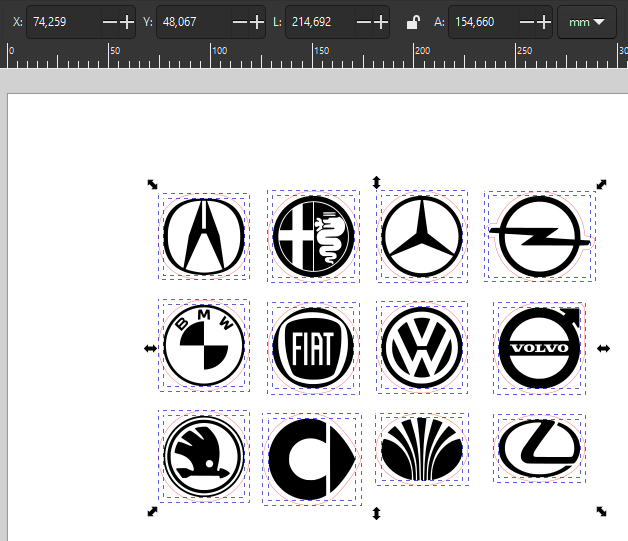
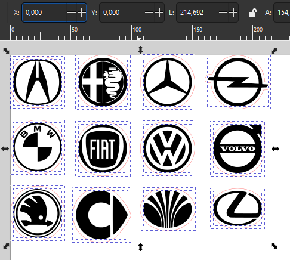
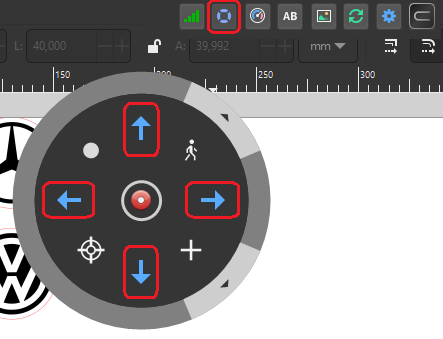
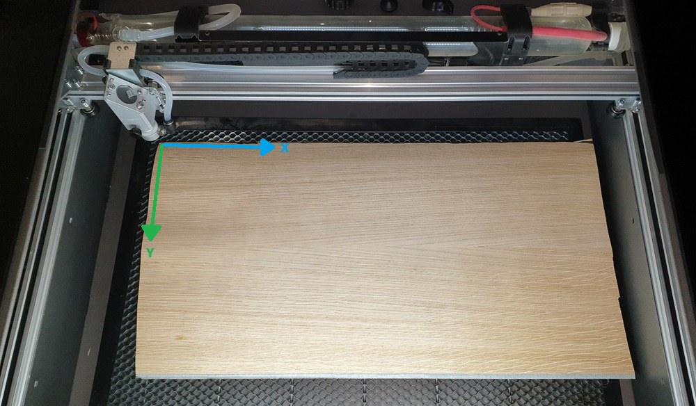
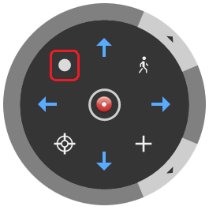
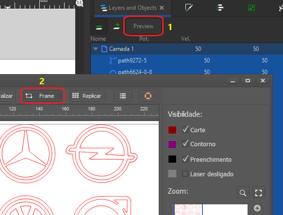
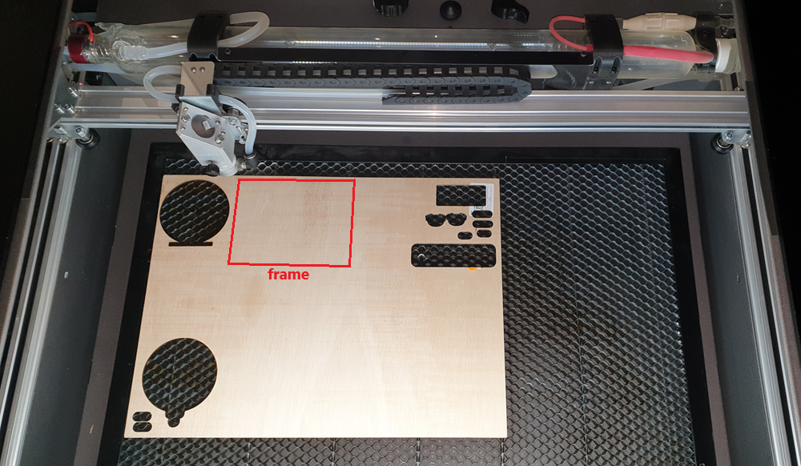

# Adjusting Material Position

Here we will explore an essential step to ensure the success of our cuts:

Positioning the design on the material. For this, it is crucial to understand the operation of the control panel in Carbon Studio. How about taking a look at this article from our series on [Studio]?

Already feel comfortable operating the machine? Then let's move on to the next step!

[Studio]: https://gadgetpluskdb.github.io/Carbon-FAQS/studio/primeiros-passos/comando-movimento/

Adjusting the design in the Carbon Studio workspace
Regardless of whether the design was created within Carbon Studio or imported from another software, it is necessary to position it at zero within the software.

* Select the elements you want to cut. The position relative to the X and Y axes is indicated in the highlighted boxes in Figure 1.

<figure markdown="span">

  { width="628" }
  <figcaption>Figure 1 - Designs in random location</figcaption>

</figure>

* Adjust the position of the designs to X=0 and Y=0. This will move the selected elements to the zero position within the software.

<figure markdown="span">

  { width="486" }
  <figcaption>Figure 2 - Designs at zero position</figcaption>

</figure>

Carbon Studio recognizes the top left corner as the starting point.

## Setting the starting point of the cut in Carbon

To let the machine know where to start the cut, it is necessary to set the starting point.

* Move the laser head with the arrows on the control panel.

<figure markdown="span">

  { width="443" }
  <figcaption>Figure 3 - Laser head movement arrows</figcaption>

</figure>

* Choose the location where you want to start the cut. To optimize material usage, position it in the top left corner.

<figure markdown="span">

  { width="800" }
  <figcaption>Figure 4 - Positioning the head on the material</figcaption>

</figure>

* Considering the position of the laser nozzle, click "set start" on the control panel.

<figure markdown="span">

  { width="265" }
  <figcaption>Figure 5 - Set start</figcaption>

</figure>

## Creating references

By making these positioning adjustments, we establish a relationship between the design position on the material and the start of the cut: the zero point of the design coincides with the starting point of the cut!

The machine always considers the last set point as the starting point. Therefore, if you move the laser head to a new position and start a new cut, it will return to the previously set point! Always set the starting point in the software (Figure 3).

## Checking the design position on the material

To ensure the best use of the workspace, it is important to know the space the design will occupy on the material. For this, we use the "Frame" feature.

* Select the design elements you want to check and click "preview > frame", as indicated in Figure 4.

<figure markdown="span">

  { width="583" }
  <figcaption>Figure 6 - Preview > Frame</figcaption>

</figure>

* The frame feature facilitates the use of material scraps, as it allows you to check if the design will fit in the desired space.

<figure markdown="span">

  { width="800" }
  <figcaption>Figure 7 - Use of scraps</figcaption>

</figure>

## Design size vs. Carbon workspace

It is crucial to remember that the size of the object cannot exceed the machine's workspace, which is 600mm in length by 400mm in width. If this happens, your work will not be executed correctly and/or the laser head will start hitting the sides of the machine, emitting a noise indicating that it is forcing the motor. Therefore, always check the design size in the workspace using the "frame" feature.

In this article, we explored how to position the design on the material to optimize our work! Join us in the next article, where we will explain how to set the [speed and power] of the machine.

[speed and power]: https://gadgetpluskdb.github.io/Carbon-FAQS/manual/primeiros-trabalhos/velocidade-potencia/
