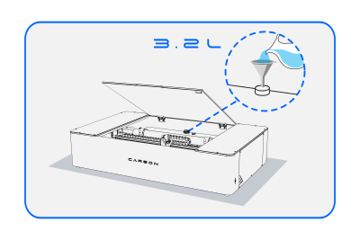
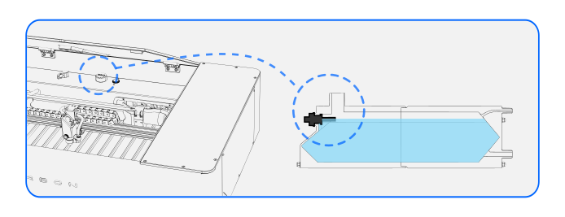
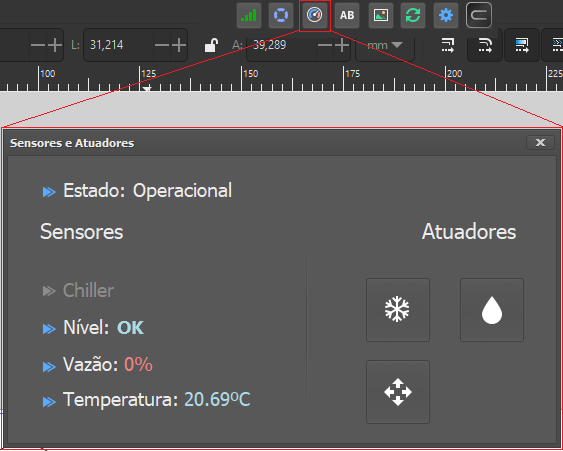

# Filling the Reservoir with Water

Water plays a fundamental role in ensuring the Neon operates properly. To maintain proper operation, it is recommended to use demineralized, distilled, or deionized water. In this article, we will guide you on how to prepare your Neon for operation, including how to fill the water reservoir, and address some common questions about the topic.

## Frequently Asked Questions

Questions often arise regarding water in the Neon. To clarify this topic further, we have prepared the article [Water in Neon], where you will find answers to questions such as:

[Water in Neon]: https://my-machinespluskdb.github.io/Neon-FAQS/maintenance/water/water-in-neon/

Why do I need to put water in my Neon?
What type of water should I use?
What should I do if I don't have special water available?
How often should I change the water?
Where can I find distilled, deionized, or demineralized water to buy?
<!--
You can watch the video below on how to fill the machine's reservoir:
-->

## Filling the Neon Reservoir

<figure markdown="span">

  { width="400" }
  <figcaption></figcaption>

</figure>

This procedure should be performed with the machine powered on.

* Using the funnel, carefully add approximately 3 liters of water to the reservoir.
* Observe the water level carefully to ensure it is correct at the start of the inlet. It is important that the water level stays above this point to ensure proper operation.
* When the Neon is powered on, water should circulate through the inside of the tube.
* Fill the reservoir with water until completely full, which should total approximately 3.2 liters of water. Visually verify the water level.

<figure markdown="span">

  { width="694" }
  <figcaption></figcaption>

</figure>

## Identifying Water Circulation

It is important to ensure water is circulating through the tube. Here are some ways to verify this:

Visual Check: Try to observe if water is flowing through the tube, although this may be difficult due to the translucent nature of water.
Air Bubbles in the Laser Tube
A common issue is the formation of air bubbles in the laser tube during the water filling process. This can be harmful to machine operation and needs to be corrected. Refer to the article [I Have Bubbles] for guidance on how to resolve this issue.

[I Have Bubbles]: https://my-machinespluskdb.github.io/Neon-FAQS/maintenance/water/have-bubbles/

## Ensuring Proper Water Level

After water circulation, the water level in the reservoir should decrease slightly because the water will fill the rest of the system "laser tube and chiller". Make sure the reservoir stays full by adjusting the level as needed.

Tip:
  If the water level is not correct, the software will warn you and prevent the machine from operating. See where you can check the water level in the software in the image below.

<figure markdown="span">

  { width="563" }
  <figcaption></figcaption>

</figure>

In this article, we covered the importance of proper water use, how to correctly fill the reservoir, and how to deal with air bubbles. In the next article of the [Getting Started] series, we will learn about the different ways to connect the Neon.

[Getting Started]: https://my-machinespluskdb.github.io/Neon-FAQS/manual/getting-started/install-Neon/