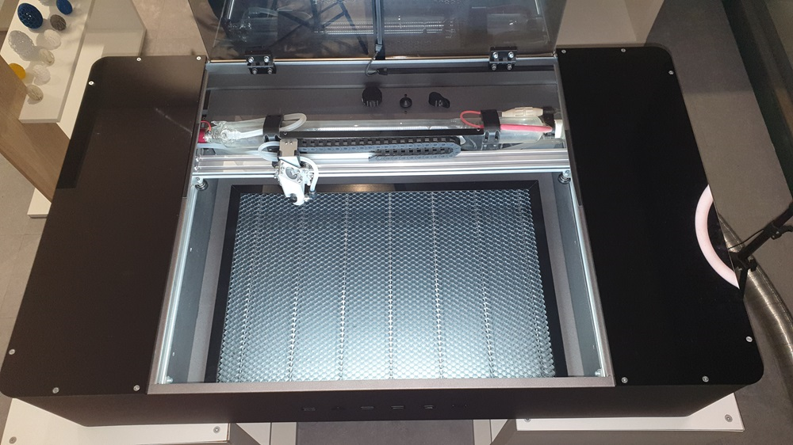
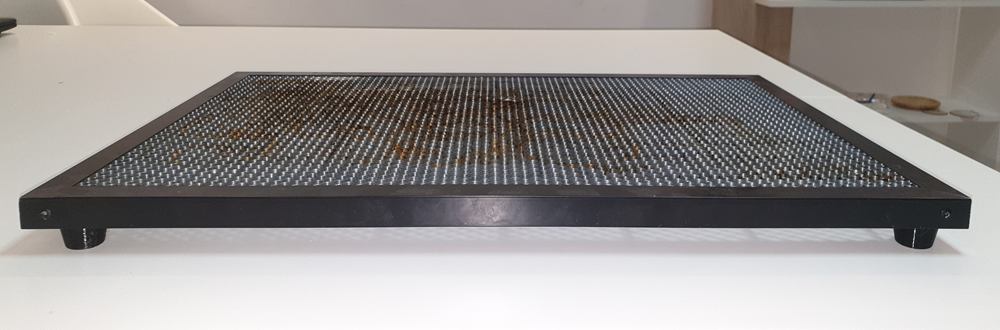
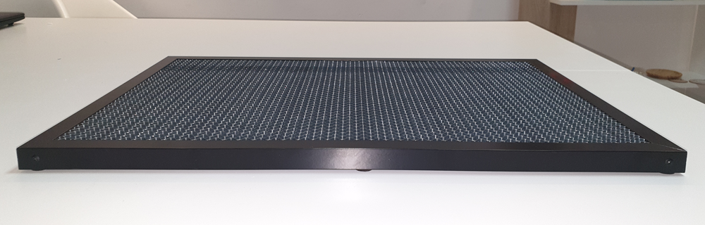

# Install the Honeycomb

In this guide, we will explain the honeycomb installation process. It's quite simple!

## Why use the Honeycomb?

The Honeycomb is a recommended accessory for work that requires delicate and small cuts.

## Honeycomb Positioning

The Honeycomb should be placed at the bottom of the machine with the support feet facing downward. The process is quite simple.

<!--
and you can check more details in the demonstration video.
[Insert video link here]
-->

<figure markdown="span">

  { width="800" }
  <figcaption>Figure 1 - Honeycomb positioned at the bottom of the machine</figcaption>

</figure>

How to use the Honeycomb with thicker materials?
If you need to cut thicker materials, you can remove the feet and position the Honeycomb directly on the bottom of the machine.
Important: Make sure there are no material remnants or dirt under the Honeycomb. It is essential that it is level to maintain focus adjustment across the work area.

<figure markdown="span">

  { width="800" }
  <figcaption>Figure 2 - Honeycomb with feet</figcaption>

</figure>

<figure markdown="span">

  { width="800" }
  <figcaption>Figure 3 - Honeycomb without feet</figcaption>

</figure>

Still have questions? Contact our support. We're here to help!

