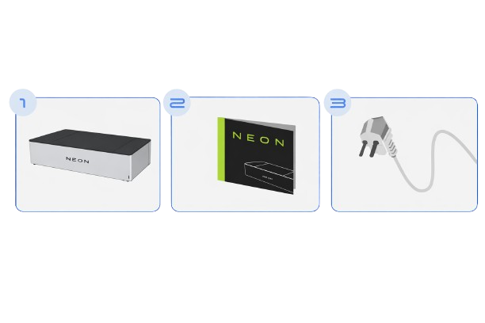
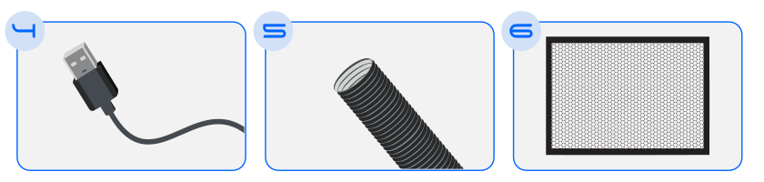
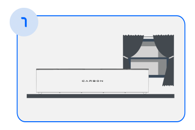
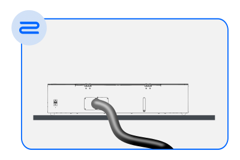
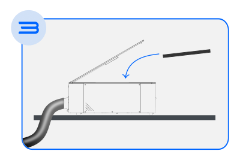
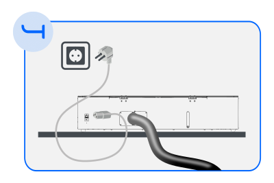

# How to Install Your Machine

Your Neon has just arrived and now it's time to start the installation!

To make this process easier, our team has prepared a complete installation guide with all the necessary information. You can download it [here] or find it on our support page.

[here]: https://gadgetpluskdb.github.io/Carbon-FAQS/transfers/#manuals

In this article, we will address the topic more comprehensively, offering some helpful tips.

## Unpacking
This is the moment when you will unpack your Neon and discover all the items that come with it.

Note: Our products are continuously being improved, so some details may vary slightly. Don’t worry — this article will make everything clear.

### Unpacking tips

It is recommended to unpack your Neon with the help of another person, as the machine is heavy and requires care.
Remove only the packing seals, preferably with wire cutters; a sharp pair of scissors will also work.

## What's included with your Neon?

<figure markdown="span">

  { width="750" }
  <figcaption></figcaption>
  
  { width="750" }
  <figcaption></figcaption>

  { width="750" }
  <figcaption>Figure 1 - Items included with the Neon</figcaption>

</figure>

* Neon: The laser cutting machine — the main piece of equipment.
* Honeycomb: Protects the bottom of the machine from the laser's effects.
* Exhaust hose: Allows toxic gases produced during cutting to be vented outside.
* Hose clamp: Secures the exhaust hose.
* Funnel: Helps when filling the water reservoir.
* Power cable (220V 10A): Connects the machine to mains power.
* USB cable: Allows you to connect your Neon to a computer.
* Focus gauge: Helps set the laser focus according to the material used.
* Neon instruction manual + Maintenance guide

## Choosing the Best Location for Your Neon

<figure markdown="span">

  { width="400" }
  <figcaption></figcaption>

</figure>

* Place the machine on a firm, level surface.
* Choose a location near a window or air outlet to vent fumes.
* If you plan to connect your Neon to your home Wi‑Fi, pick a spot close to your router for a stronger signal.

## Taking Care of Exhaust

<figure markdown="span">

  { width="400" }
  <figcaption></figcaption>

</figure>

* Connect one end of the exhaust hose to the back of the machine.
* Secure it with the clamp.
* The other end of the hose should be directed to a window or air outlet.
* The gases released during cutting can be toxic and harmful to your health, so pay attention to this step.

## Installing Bottom Protection

<figure markdown="span">

  { width="400" }
  <figcaption></figcaption>

</figure>

* Open the Neon lid.
* Remove the honeycomb attachment tape.
* Position it at the bottom of the machine, ensuring the black side faces up. You can find more detailed information in the [honeycomb] section.

[honeycomb]: https://gadgetpluskdb.github.io/Carbon-FAQS/manual/getting-started/honeycomb/

## Connecting to the Power Supply

<figure markdown="span">

  { width="400" }
  <figcaption></figcaption>

</figure>

* Connect the power cable from the machine's rear inlet to a standard 10A mains outlet with the voltage indicated on your machine (220V).
* Proper grounding is essential. The Neon can malfunction or suffer component damage if connected to an ungrounded electrical installation. See our [safety] section "Socket Instructions" for more information.

[safety]: https://gadgetpluskdb.github.io/Carbon-FAQS/safety/socket-instructions/

* Power on the Neon.

Tips:

To check whether your workspace has proper grounding, consult a qualified technician such as an electrician.
Older electrical installations may lack grounding, so be sure to verify.
Two‑pin outlets do not provide grounding. Do not use adapters to connect your Neon to such outlets.

In this article we covered how to install all the components of your Neon. The next step is to prepare it for use by filling the water reservoir.

Don't miss the next article in this series: [Fill Reservoir].

[Fill Reservoir]: https://gadgetpluskdb.github.io/Carbon-FAQS/manual/getting-started/fill-reservoir/