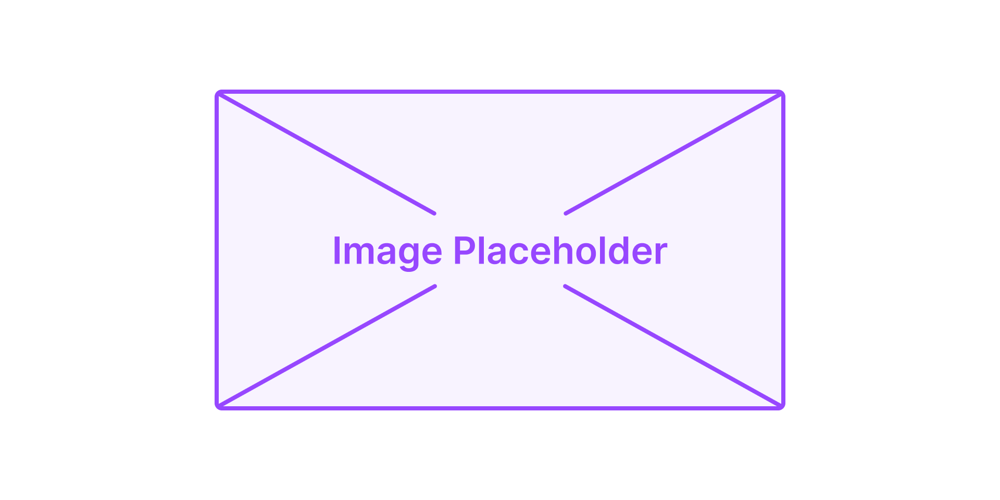

# Remove Protective Support

<figure markdown="span">
  
  { width="610" }
  <figcaption></figcaption>

  { width="610" }
  <figcaption></figcaption>
  
</figure>

When you receive your Neon, you probably noticed the presence of a protective support for the tube. This support is located at the back, on the sides of the movement unit, as shown in the image below:

<figure markdown="span">

  { width="450" }
  <figcaption>Figure 1 - Protective support</figcaption>

</figure>

This support has the sole function of protecting the tube during shipping and should be removed as soon as you receive your machine. You can do this using the 2.5mm allen key that comes with your Neon.

Done! Now you can proceed with the installation process!