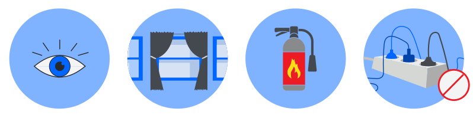
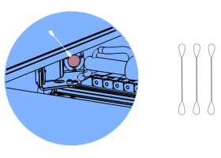
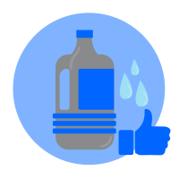
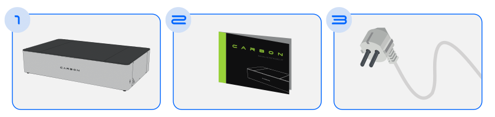
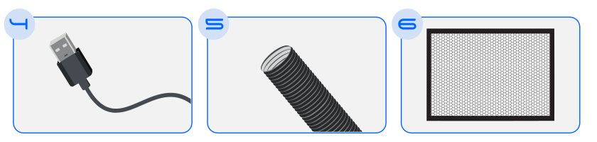
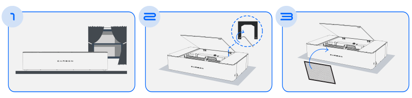
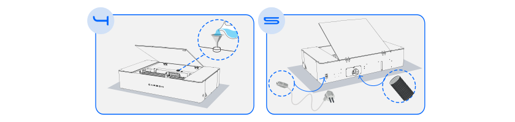

# Online Manual

## Welcome to the online manual

We are immensely pleased to congratulate you on the purchase of this product.
This is the Instruction Guide for the Carbon Laser Cutting and Engraving Machine, an innovative creation by Gadget.

Carbon is a machine that combines convenience, precision, and efficiency in a single device, representing an affordable solution without compromising excellence.

Here you will find all the essential information for users to make the most of the resources and possibilities of this product, from initial setup to advanced operation tips.

We are excited to have you on board this journey of discovery and achievement with the Carbon Laser Cutting and Engraving Machine.
On behalf of the entire Gadget team, we wish you incredible experiences and impressive results.

Welcome to the future of laser cutting and engraving technology!

## Safety Instructions

<figure markdown="span">

  { width="700" }

  <figcaption></figcaption>
</figure>

* NEVER leave the machine operating unattended without the supervision of a qualified professional, especially during long cutting or engraving jobs.
* Do not connect the machine's power cable to an extension cord with multiple devices simultaneously.
* Ensure that the materials to be cut are safe for use with the laser cutting machine and are within the machine's specifications. NEVER use prohibited materials such as CHLORINE or VINYL compounds.
* Ensure that the operating area is well-ventilated to eliminate possible toxic fumes or gases produced during the laser cutting process.
* Follow the manufacturer's recommended maintenance schedule to ensure proper machine operation.
* Keep a fire extinguisher near the machine and know how to use it in case of fire. Keep flammable materials away from the work area.
* In case of malfunction, immediately turn off the machine and contact support.

Safety during the operation of the Carbon Laser Cutting and Engraving Machine is an absolute priority.
To ensure safe and risk-free operation, Carbon is equipped with intelligent sensors that constantly monitor operating conditions:

1. Open Lid Sensor, which does not allow the process to proceed when the lid is not properly closed.
2. Temperature Sensor, which pauses operation in conditions of excessive heat.
3. Level Sensor that controls the water level in the chiller reservoir, ensuring it is always adequate for optimal performance.

## Machine Care

Regularly clean the lenses and optical mirrors to maintain cutting quality.

{ align=left }

Use damp cotton swabs to clean, always very gently, in circular motions, and change the cotton swab until it comes out completely clean.

&nbsp;  
&nbsp;  
&nbsp;  

Use distilled or demineralized water in the cooling system to prevent the formation of mineral deposits that could obstruct the flow.

<figure markdown="span">

  { width="180" }

  <figcaption></figcaption>
</figure>

## Package Contents

<figure markdown="span">

  { width="750" }
  <figcaption></figcaption>

</figure>

1. Carbon - Laser Cutting and Engraving Machine
2. Instruction Manual
3. Power Cable

<figure markdown="span">

  { width="750" }
  <figcaption></figcaption>

</figure>

4. USB Cable
5. Exhaust Hose
6. Honeycomb

<figure markdown="span">
  
  { width="750" }
  <figcaption></figcaption>
  
</figure>

7. Focus Gauge
8. Funnel

## Technical Data

### Front Perspective

<figure markdown="span">

  { width="500" }
  <figcaption></figcaption>

  { width="500" }
  <figcaption></figcaption>

</figure>

A. Side Mirrors

B. Open Lid Safety Sensor

C. Chiller Water Inlet

D. Pressure Regulator

E. CO2 Laser Tube

F. USB Cable Connection

### Rear Perspective

<figure markdown="span">

  { width="500" }
  <figcaption></figcaption>

  { width="500" }
  <figcaption></figcaption>

</figure>

A. Machine Lid

B. Water Outlet Hose Connection

C. Exhaust Hose Connection

D. Power Cable Connection

E. On/Off Button

### Specifications

|Description                   | Values                                   |
|:-----------------------------|:-----------------------------------------|
|External Dimensions           |(L) 1102mm x (W) 697mm x (H) 245mm        |
|Work Area                     |600mm x 400mm                             |
|Maximum Material Height       |80mm (Without honeycomb)                  |
|Standard Ambient Temperature  |5ºC - 35ºC                                |
|Power/Consumption             |700w                                      |
|Materials                     |Non-ferrous - Approx. up to 6mm thickness |
|Laser Type                    |CO2                                       |
|Laser Power                   |50W                                       |
|Maximum Speed                 |7000mm/min                                |
|Weight                        |45Kg                                      |
|Voltage                       |220V/240V                                 |
|Connections                   |USB                                       |
|Control Software              |Carbon Studio                             |

## Machine Installation

<figure markdown="span">

  { width="750" }
  <figcaption></figcaption>
  
  { width="750" }
  <figcaption></figcaption>
  
</figure>

1. When removing the product from the packaging, place it on a flat and ventilated surface, near an air outlet.
2. Using a key, remove the internal lock and transport protections.
3. Insert the honeycomb inside the machine.
4. In the internal reservoir, using a funnel, add approximately 3.2L of distilled or demineralized water. Once the level is reached, save the remaining water to top up later.
5. At the rear, connect the exhaust hose and the power cable, then turn on the machine.

---

Now, to proceed with the next steps of configuring the machine, we will need to connect the machine to a computer through the Carbon software.

## Software Installation

1. Download Carbon Studio from our website: www.gadgetplus.pt
2. With the program open, connect via Wifi or USB cable. See below how each type of connection works:

{ align=left }

After the water circulates internally through the machine hoses, check the internal reservoir again and add the remaining demineralized water.

Total amount 3.2L.

Done! Now your laser machine is ready to start cutting and engraving.

!!! warning "Attention"
    
    Ensure that there are no air bubbles in the hose through which the demineralized water passes.
    These air bubbles are extremely dangerous to the CO2 laser.

    If there are, check our knowledge base for the procedure to [remove the bubbles].

[remove the bubbles]: https://gadgetpluskdb.github.io/Carbon-FAQS/maintenance/water/remove-bubbles/
    

## Troubleshooting

Consult the online knowledge base in the [Troubleshooting] section for more detailed information.

[Troubleshooting]: https://gadgetpluskdb.github.io/Carbon-FAQS/troubleshooting/different-cut/adjust-belts/

There you can find operating instructions, safety tips, usage tips, and possible problem-solving.
You can also get the latest versions of the guides and software.
If you have additional questions, our support team is available to assist you.

[suporte@gadgetplus.pt]

[suporte@gadgetplus.pt]: mailto:suporte@gadgetplus.pt

## Warranty

This product is manufactured under the strict quality control system of Gadget Lda.

If the product fails within three (3) years from the date of purchase, under normal use conditions, Gadget Lda will repair or replace the product free of charge in the following ways:

* Using new or refurbished replacement parts.
* Exchanging the product for a new product or one that has been manufactured with new or usable used parts, with performance at least equivalent to the original product.

Proof of the purchase date must be confirmed and sent along with a copy of the original purchase document. The warranty is valid under normal use conditions. The warranty covers failure in the Gadget Plus, Lda product that could be related to material and/or manufacturing errors. The warranty is valid only in the country of purchase.

The warranty is not valid in the following cases:

* If the user uses prohibited materials.
* If the user leaves the machine working unattended.
* If the product is broken due to improper handling or incorrect operation.
* If the product has been exposed to extreme temperatures, calamity, or high voltage shock.
* If the product has been modified, repaired, or disassembled by unauthorized personnel.
* In these cases, the costs of shipping, repairing parts, and/or replacement are not included in the warranty.

[www.gadgetplus.pt]

[www.gadgetplus.pt]: www.gadgetplus.pt

[suporte@gadgetplus.pt]

[suporte@gadgetplus.pt]: mailto:suporte@gadgetplus.pt