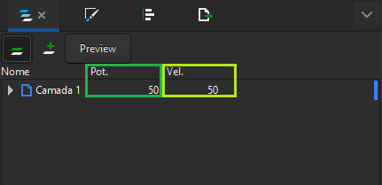

# Speed and Power Parameters

The laser cutting process requires the precise definition of two fundamental parameters: speed and power. Let's explore in more detail the meaning of these factors and learn how to adjust them to optimize results.

## Understanding the parameters

### Speed:

  Refers to how fast the laser beam moves across the work area, determining the efficiency of cutting or engraving.
  Analogy with fire: The longer the fire stays in one spot (slower speed), the deeper the burn in the material.

### Power:

Indicates the intensity of the energy emitted by the laser, directly influencing the cutting or engraving capability.
Analogy with fire: Higher power is similar to a more intense fire, resulting in a more pronounced cutting or engraving action.

The proper combination of these parameters (speed and power) is crucial to achieving a balance between cutting efficiency and finish quality.
Finding this balance is essential to achieving consistent and satisfactory results.

<figure markdown="span">

  { width="220" }
  <figcaption></figcaption>

  { width="220" }
  <figcaption></figcaption>

</figure>

<em>Figure 1 - Relationship between speed and power</em>

* The higher the speed and the lower the power, the shallower the cut or engraving.
* Lower speed and higher power will result in a deeper action.

## Setting parameters in Carbon Studio

The parameters are adjusted according to the layer selected in the software, available on the right side of the screen. Precision in defining these parameters is essential to ensure the success of the cutting or engraving process.

<figure markdown="span">

  { width="431" }
  <figcaption>Figure 2 - Parameter definition</figcaption>

</figure>

## Finding the best parameters for your material

### Identifying the ideal parameters requires a practical and experimental approach.

Due to the variety of materials and their specific characteristics, it is important to perform [tests to determine the most suitable settings].

[tests to determine the most suitable settings]: https://gadgetpluskdb.github.io/Carbon-FAQS/truques-%26-dicas/testes-parametros/

### To facilitate this process, we have developed cutting templates!

These templates allow you to test various parameter combinations, helping to identify the optimal setting for each type of material. Additionally, we [provide] some files in Carbon Studio to simplify this testing and adjustment process.

[provide]: https://gadgetpluskdb.github.io/Carbon-FAQS/transferencias/#arquivos-para-testes-de-parametros

In this article, we deepened our understanding of speed and power parameters, explored how to configure them in Carbon Studio, and recognized the importance of practical tests to determine the ideal adjustments. This information is fundamental to ensuring consistent and high-quality results in the laser cutting process.
