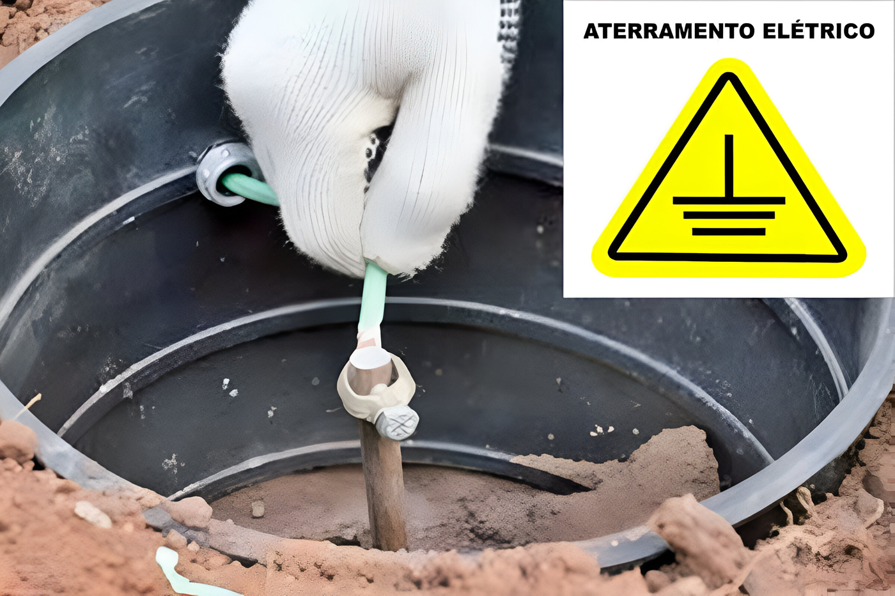

# Why is grounding necessary in outlets?

Certainly, you must have heard about the concept of grounding in outlets, right?
Simply put, the grounding system involves a rod driven into the ground, connected to a wire, usually in green and yellow colors, that runs throughout the house, as exemplified in the image below:

<figure markdown="span">

  { width="500" }
  <figcaption>Figure 1: Outlet grounding</figcaption>

</figure>

Three-pin outlets generally indicate the presence of grounding, but it is crucial to confirm if the building or house's electrical network is effectively grounded. It may happen that there is no wire connected to this pin, resulting in the lack of grounding in the outlet.

## So, why is grounding so important?

The main objective of grounding the outlet is to reduce voltage variations in the electrical network, eliminate energy leaks, and protect users against possible electric shocks. It prevents shocks when using household appliances, for example.

In the case of your Carbon, grounding is not just a safety issue but also influences the machine's operation. The CO2 laser requires high voltage (20,000 volts), generating an electromagnetic field that induces a current. This current must be directed to the ground; without it, it may end up going to the machine's control board, impairing the proper functioning of your Carbon or even damaging components.

## How can I check if my outlet has grounding?

!!! warning "Check"

    **Visually:** You can confirm if the outlet has 3 connected wires (although this does not fully guarantee grounding, if there are only two wires, it confirms that it does not have grounding).

!!! warning "Caution"

    **Checking** the wires inside the outlet requires a lot of attention to avoid electric shocks. We recommend that an electrician perform this check, with additional precautions such as turning off the power panel and not touching the wires.

<figure markdown="span">

  { width="500" }
  <figcaption>Figure 3: Example of an outlet with three grounding</figcaption>
  
</figure>

## What are the signs that my outlet does not have grounding?

The absence of grounding in the electrical network can result in some problems when using your Gadget Carbon, the main ones being:

1.	Light shock when touching the machine's casing.
2.	Loss of connection or interruption of work without warning in Carbon Studio.
3.	Appearance of random lines during a job, not present in the file or preview.
4.	Loss of steps due to high voltage influence on motors or the control board.
5.	Damage to electronic components due to leaks and energy variations.

Another important point is the use of power extensions, many of which have the third pin intended for grounding but may not have a third wire in their internal wiring. Whenever possible, it is recommended to use power strips with grounding or connect the power cable directly to your Carbon's outlet.

!!! warning "Important"

    According to our warranty terms, using the machine in places without grounding will result in the total loss of the warranty.