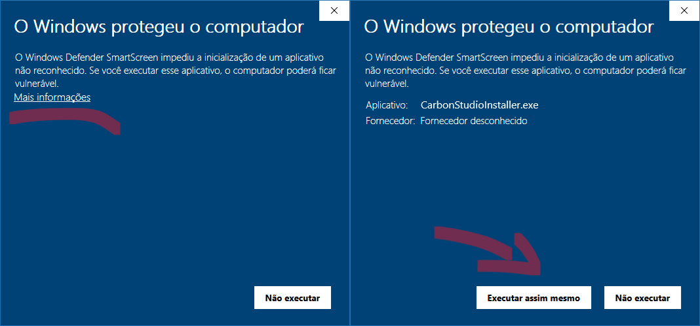
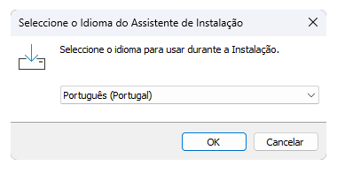
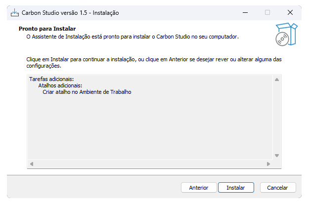
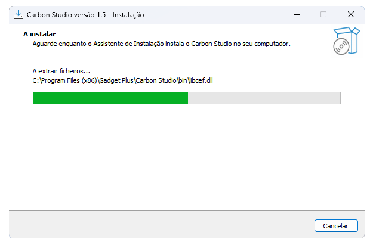
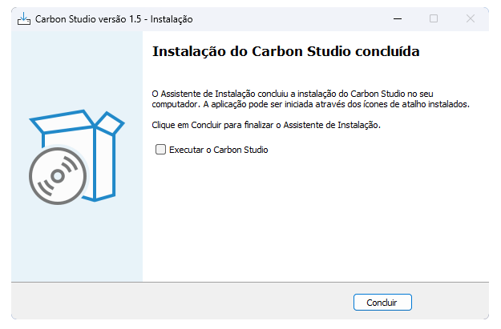

# Installation of Carbon Studio

In this guide, we will explain how you can install the necessary programs to use your Gadget on Windows 10 or later versions.

## Carbon Studio Software

Carbon Studio is an improved version of Inkscape, specifically designed to facilitate the use of your Carbon. Currently, it is only available for Windows 10 or higher operating systems.

## Instructions to install Carbon Studio
<!--
You can follow the instructions in this video:

[Video 1: Installing and using Carbon Studio.]

Or, if you prefer, follow the steps below:
-->

* Access the [downloads] page of the software.
* Choose the link of Carbon Studio compatible with your Carbon.
* You will be redirected to a page on Google Drive. Click on ==Download== > ==Download anyway== to start the download. ==Fig 1:==

[downloads]: https://edgarmata.github.io/Carbon-FAQS/transferencias/

<figure markdown="span">

   { width="504" }
   <figcaption>Fig 1: Google Drive Alert.</figcaption>

</figure>

!!! info "Antivirus Warning"
      
      If your browser or antivirus identifies the program as “Malicious” or “Unknown”, you can proceed with the download. Carbon Studio is safe and virus-free.

* After the download, run the downloaded program.
* If a Windows security message appears, click on ^^More info^^ and then ==Run anyway==

<figure markdown="span">

   { width="800" }
   <figcaption>Fig 2: Windows Security Alert.</figcaption>

</figure>

!!! success "You can continue"

      Click on ==Run anyway== to open the installer. ==Fig: 2==

<figure markdown="span">

   { width="480" }
   <figcaption>Fig 3: Administrator Permission.</figcaption>

</figure>

* If prompted, grant administrator permissions to complete the installation. ==Fig 3:==
* In the installer, follow the instructions in the figures below.
* When the process is finished, click on ==Finish==.

<figure markdown="span">

   { width="380" }
   <figcaption>Fig 4: Install</figcaption>
  
   { width="625" }
   <figcaption>Fig 5: Install</figcaption>

   { width="625" }
   <figcaption>Fig 6: Install</figcaption>

   { width="625" }
   <figcaption>Fig 7: Install</figcaption>

   { width="625" }
   <figcaption>Fig 8: Install</figcaption>
  
</figure>

* Done, Carbon Studio is installed on your system!

Want to learn more about how to use the software? Keep following our series of articles about Carbon Studio [Here].

[Here]: https://edgarmata.github.io/Carbon-FAQS/studio/altualiza%C3%A7%C3%A3o-software/

You have learned how to install the necessary software to control your Carbon on Windows 10 or later versions. Now, the next step is to connect your Carbon to the computer.